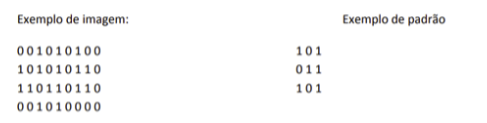

Uma imagem em preto e branco, de tamanho m x n, pode ser representada por uma matriz cujos elementos assumem valores no conjunto {0,1}. Dado um padrão representado por uma matriz 3x3 também assumindo valores em {0,1}, escreva uma função, ou trecho de código, que determine se o padrão existe ou não na imagem.

